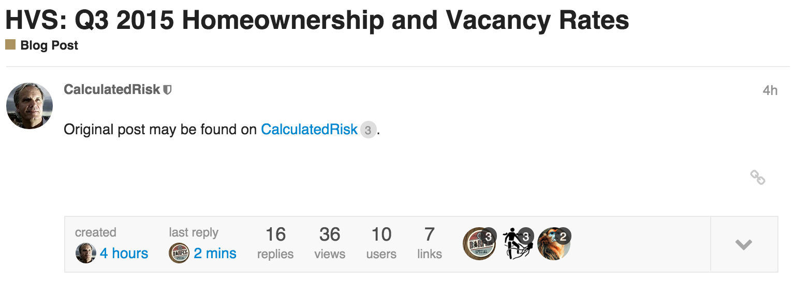
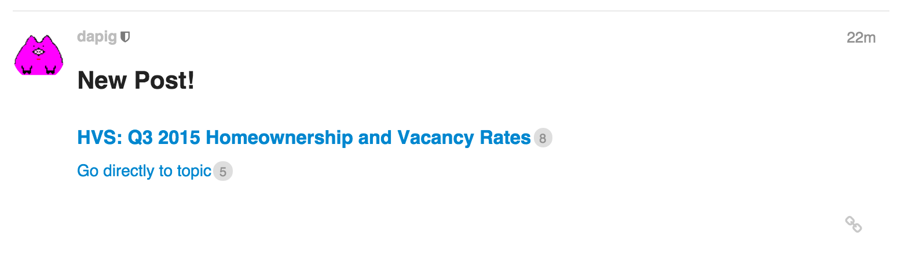
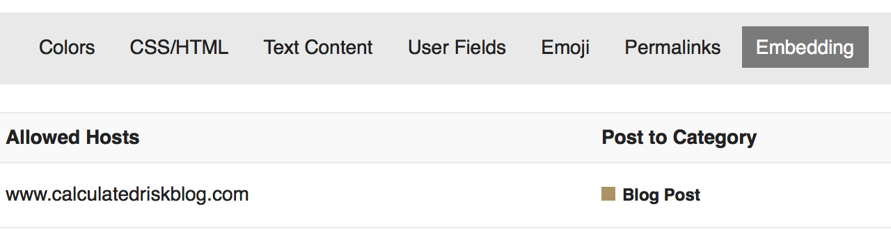
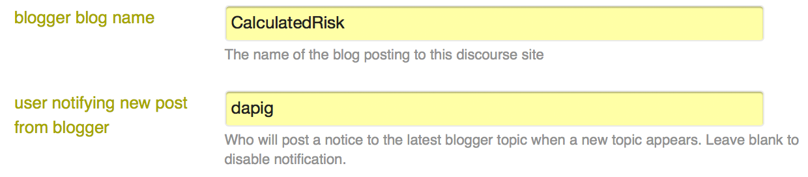

Discourse Blogger Plugin
========================

This [discourse](http://www.discourse.org/) plugin integrates a Blogger blog with Discourse as an alternative to Discourse
embedding. Each blog post contains a comments link, which when navigated for the first time generates a topic on the discourse
server with the post's title, author, and permalink. Subsequent navigations return to the same topic.

Note that we are not actually embedding comments in the blog, just linking them to a Discourse site. For static embedding, see [here](https://meta.discourse.org/t/embedding-discourse-comments-via-javascript/31963).

In addition, the plugin adds post counts to each link.

As a bonus, if you want a post automatically added to the end of the most recently created blog topic, that says "New Post!", specify a username you want
to be the author of this notification. Leave this blank to disable it.

# Demo

The financial blog [Calculated Risk](http://http://www.calculatedriskblog.com/) has its comments linked to the
Discourse discussion site [Hoocoodanode?](http://hoocoodanode.org) using this plugin.

## Installation

Please read the official discourse [plugin installation](https://meta.discourse.org/t/install-a-plugin/19157)
documentation.

If you use the (officially recommended) [docker setup](https://github.com/discourse/discourse/blob/master/docs/INSTALL.md)
you can just have to add `git clone https://github.com/kcoop/discourse-blogger-plugin.git`
to the list of `after_code` executions in your `/var/discourse/containers/app.yml`
file. (filename might be different in your setup!)

# Blogger Template Configuration

The blog post template on Blogger needs to contain the following script at the bottom of the body (replace DISCOURSE_URL with your Discourse site, including http://):

    

In addition, comment links should be in the following format (replace DISCOURSE_URL with your Discourse site, including http://).

    <a class='comment-link' expr:href='&quot;DISCOURSE_URL/blogger/topic?ts=&quot; + data:post.timestamp + &quot;&amp;author=&quot; + data:post.author + &quot;&amp;pl=&quot; + data:post.url + &quot;&amp;nojs=y&quot;' target='_blank'>
      <data:post.title/>
      Comments
    </a>

# Discourse Configuration

Follow the directions for [creating an embeddable host on your Discourse site](https://meta.discourse.org/t/embedding-discourse-comments-via-javascript/31963).

This plugin will use the embed allowed host and category you specify for embeds for new topics, and will use the topic creation user you specify here if the author
from your blog post doesn't have a matching name on your discourse site.

Under plugin settings, set the name of the blog. This will appear in various places when posts are added.

If you want a post automatically added to the end of the most recently created blog topic, that says "New Post!", specify a username you want
to be the author of this notification. Leave this blank to disable it.

#  CORS Support

You will also need to enable CORS support in order to allow access to a different origin from the script. See here for Docker:
https://meta.discourse.org/t/how-to-enable-cross-origin-resource-sharing-with-docker/15413

